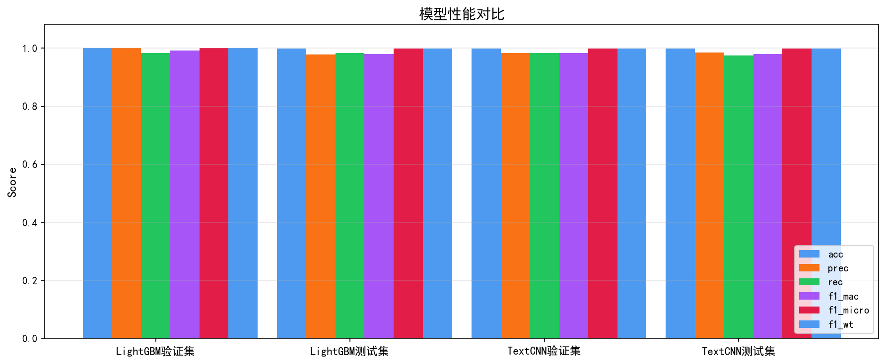
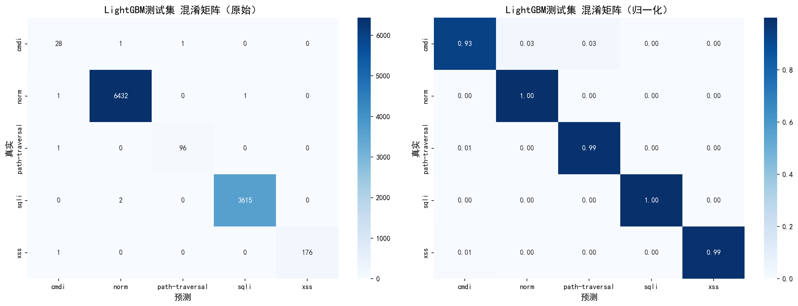
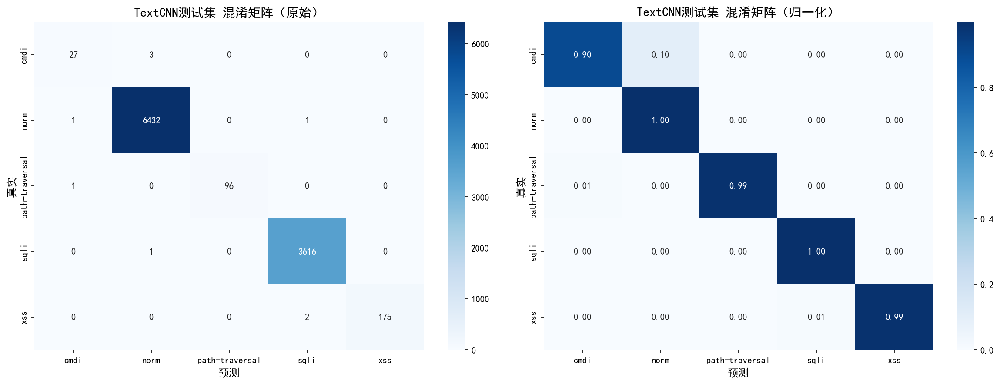
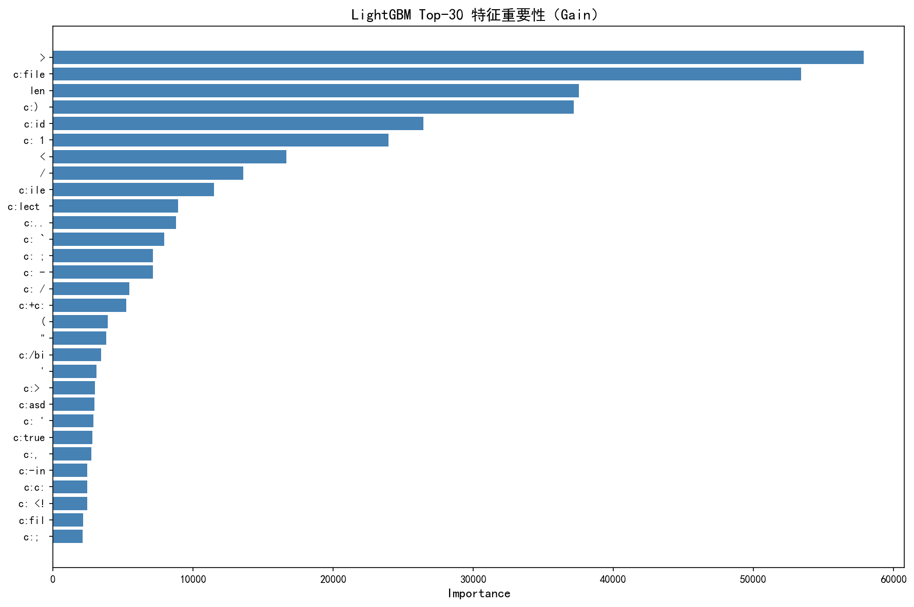
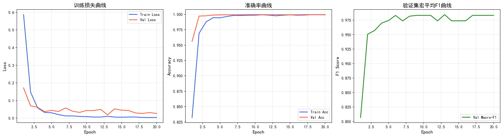

# WAD 模型训练结果

## 概述

本文档记录 WAD (Web Attack Detection) 系统中 LightGBM 和 TextCNN 两个模型的训练结果和性能评估。

---

## 一、数据集

### 1.1 数据集信息

| 项目 | 数值 |
|------|------|
| 数据集名称 | HttpParamsDataset |
| 总样本数 | 31,067 条 |
| 训练集 | 16,569 条 |
| 验证集 | 4,143 条 |
| 测试集 | 10,355 条 |
| 分类数 | 5 类 |

### 1.2 类别分布

| 类别 | 训练集 | 验证集 | 测试集 | 说明 |
|------|--------|--------|--------|------|
| norm | 10,296 | 2,574 | 6,434 | 正常流量 |
| sqli | 5,788 | 1,447 | 3,617 | SQL注入 |
| xss | 284 | 71 | 177 | XSS攻击 |
| path-traversal | 154 | 39 | 97 | 路径穿越 |
| cmdi | 47 | 12 | 30 | 命令注入 |

### 1.3 数据预处理

1. **URL 解码**：3 轮 URL 解码，处理多层编码
2. **HTML 实体还原**：`&lt;` → `<`，`&gt;` → `>` 等
3. **转小写**：统一大小写
4. **空白压缩**：连续空白压缩为单个空格

---

## 二、LightGBM 模型

### 2.1 特征工程

| 特征类型 | 维度 | 参数配置 |
|----------|------|----------|
| 字符级 TF-IDF | 50,000 | analyzer=char_wb, ngram_range=(2,5) |
| 词级 TF-IDF | 30,000 | analyzer=word, ngram_range=(1,2) |
| 手工统计特征 | 19 | 特殊字符计数、攻击模式匹配等 |
| **总计** | **80,019** | |

### 2.2 模型超参数

```python
learning_rate = 0.05
num_leaves = 127
min_child_samples = 5
feature_fraction = 0.8
bagging_fraction = 0.8
bagging_freq = 5
lambda_l1 = 0.1
lambda_l2 = 0.1
n_estimators = 500
early_stopping_rounds = 30
class_weight = 'balanced'
```

### 2.3 训练结果

| 指标 | 数值 |
|------|------|
| 最佳迭代轮数 | 310 轮 |
| 早停触发轮数 | 340 轮 |
| 训练时间 | ~2 分钟 |

### 2.4 测试集性能

| 指标 | 数值 |
|------|------|
| Accuracy | 99.95% |
| Precision (macro) | 98.18% |
| Recall (macro) | 99.67% |
| F1 (macro) | 98.88% |
| F1 (weighted) | 99.95% |

### 2.5 各类别性能

| 类别 | Precision | Recall | F1-Score | Support |
|------|-----------|--------|----------|---------|
| norm | 1.00 | 1.00 | 1.00 | 6,434 |
| sqli | 1.00 | 1.00 | 1.00 | 3,617 |
| xss | 1.00 | 1.00 | 1.00 | 177 |
| path-traversal | 0.99 | 1.00 | 0.99 | 97 |
| cmdi | 0.94 | 0.97 | 0.95 | 30 |

---

## 三、TextCNN 模型

### 3.1 网络架构

```
输入层：字符序列（长度 200）
    ↓
Embedding 层：词表大小 97，嵌入维度 64
    ↓
并行卷积层（4 个）：
  - Conv1d(kernel_size=2, filters=128)
  - Conv1d(kernel_size=3, filters=128)
  - Conv1d(kernel_size=4, filters=128)
  - Conv1d(kernel_size=5, filters=128)
    ↓
自适应最大池化
    ↓
拼接：4 × 128 = 512 维
    ↓
Dropout(0.5)
    ↓
全连接层：Linear(512, 5)
```

### 3.2 训练配置

```python
seq_length = 200
batch_size = 256
optimizer = Adam(lr=1e-3, weight_decay=1e-4)
scheduler = ReduceLROnPlateau(factor=0.5, patience=3)
early_stopping = 7
max_epochs = 30
```

### 3.3 训练结果

| 指标 | 数值 |
|------|------|
| 最佳 epoch | 第 13 轮 |
| 早停触发 epoch | 第 20 轮 |
| 训练时间 | ~5 分钟 |

### 3.4 测试集性能

| 指标 | 数值 |
|------|------|
| Accuracy | 99.94% |
| Precision (macro) | 99.27% |
| Recall (macro) | 97.99% |
| F1 (macro) | 98.61% |
| F1 (weighted) | 99.94% |

### 3.5 各类别性能

| 类别 | Precision | Recall | F1-Score | Support |
|------|-----------|--------|----------|---------|
| norm | 1.00 | 1.00 | 1.00 | 6,434 |
| sqli | 1.00 | 1.00 | 1.00 | 3,617 |
| xss | 1.00 | 1.00 | 1.00 | 177 |
| path-traversal | 1.00 | 1.00 | 1.00 | 97 |
| cmdi | 0.97 | 0.90 | 0.93 | 30 |

---

## 四、模型对比

### 4.1 整体性能对比

| 模型 | Accuracy | Precision | Recall | Macro F1 | Weighted F1 |
|------|----------|-----------|--------|----------|-------------|
| LightGBM | 99.95% | 98.18% | 99.67% | 98.88% | 99.95% |
| TextCNN | 99.94% | 99.27% | 97.99% | 98.61% | 99.94% |

### 4.2 各类别 F1-Score 对比

| 类别 | 测试样本数 | LightGBM F1 | TextCNN F1 | 差异 |
|------|-----------|-------------|------------|------|
| norm | 6,434 | 1.00 | 1.00 | 0.00 |
| sqli | 3,617 | 1.00 | 1.00 | 0.00 |
| xss | 177 | 1.00 | 1.00 | 0.00 |
| path-traversal | 97 | 0.99 | 1.00 | +0.01 |
| cmdi | 30 | 0.95 | 0.93 | -0.02 |

### 4.3 性能对比图表



---

## 五、混淆矩阵

### 5.1 LightGBM 混淆矩阵



### 5.2 TextCNN 混淆矩阵



---

## 六、特征重要性

### 6.1 LightGBM 特征重要性 Top 20



### 6.2 关键特征

1. **特殊字符计数**：`'`、`"`、`<`、`>`、`/`
2. **攻击模式**：`select`、`union`、`script`、`../`
3. **逻辑运算符**：`or`、`and`
4. **注释符号**：`--`、`/*`

---

## 七、训练曲线

### 7.1 TextCNN 训练曲线



### 7.2 训练过程分析

- **损失下降**：训练损失快速下降并收敛
- **准确率提升**：验证集准确率快速提升
- **早停触发**：在第 20 轮触发早停，避免过拟合

---

## 八、结论

### 8.1 模型选择建议

| 场景 | 推荐模型 | 原因 |
|------|----------|------|
| 高并发 | LightGBM | 推理速度快（< 5ms） |
| 高准确率 | TextCNN | 能捕捉更复杂的特征 |
| 资源受限 | LightGBM | 内存占用少（~200MB） |
| 实时检测 | LightGBM | 延迟低 |

### 8.2 性能总结

1. **整体性能**：两个模型均达到 99.9%+ 准确率
2. **多数类性能**：norm 和 sqli 类别 F1 均为 1.00
3. **少数类性能**：cmdi 类别性能稍低（F1: 0.93-0.95）
4. **泛化能力**：在密封测试集上表现稳定

### 8.3 改进方向

1. **数据增强**：增加少数类样本（cmdi、path-traversal）
2. **特征工程**：探索更多有效特征
3. **模型集成**：结合两个模型的优势
4. **实时优化**：模型压缩和量化

---

## 九、复现指南

### 9.1 环境配置

```bash
# 创建虚拟环境
conda create -n wad python=3.9
conda activate wad

# 安装依赖
pip install -r Train_Model/requirements.txt
```

### 9.2 训练命令

```bash
cd Train_Model
python train.py
```

### 9.3 生成图表

```bash
python generate_paper_figures.py
```

### 9.4 输出文件

训练完成后，以下文件将生成在 `outputs/` 目录：

- `lgbm_model.txt` - LightGBM 模型
- `textcnn_best.pt` - TextCNN 模型
- `char_tfidf.pkl` - 字符级 TF-IDF 向量化器
- `word_tfidf.pkl` - 词级 TF-IDF 向量化器
- `label_encoder.pkl` - 标签编码器
- `model_comparison.csv` - 模型对比结果
- `*.png` - 各种图表

---

## 十、引用

如果使用了本项目的模型或数据集，请引用：

```bibtex
@software{wad2024,
  title={WAD: Web Attack Detection System},
  author={Your Name},
  year={2024},
  url={https://github.com/your-username/Web-Attack-Detection-System-HttpParamsDataset}
}

@dataset{http_params_dataset,
  title={HttpParamsDataset: HTTP Request Parameter Values Dataset},
  year={2024},
  url={https://github.com/your-username/HttpParamsDataset}
}
```

---

**最后更新**：2026-06-23